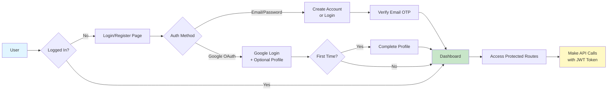
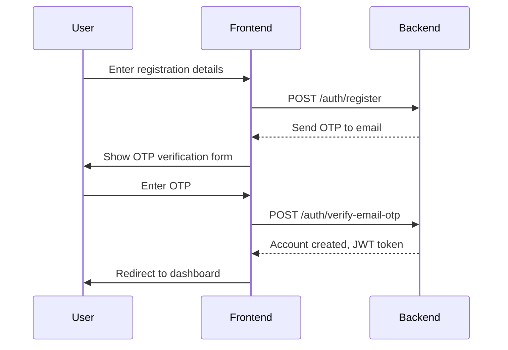
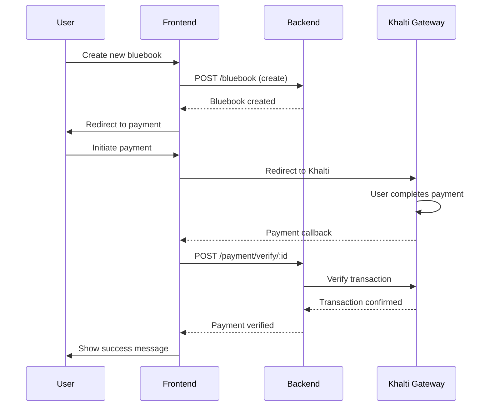

# Bluebook Renewal System - Frontend

A modern, responsive React application for vehicle registration (bluebook) renewal and management. This frontend provides a seamless user experience for renewing bluebooks, managing electric vehicles, verifying identities (KYC), and processing secure payments.

## Table of Contents

- [Features](#features)
- [Architecture](#architecture)
- [Technologies Used](#technologies-used)
- [Project Structure](#project-structure)
- [Pages & Routes](#pages--routes)
- [Components](#components)
- [Getting Started](#getting-started)
- [Build & Deployment](#build--deployment)
- [Environment Variables](#environment-variables)
- [Authentication Flow](#authentication-flow)

## Features

- **User Authentication:** Secure login, registration, and profile management with JWT tokens. Supports traditional credentials and Google OAuth for seamless sign-up.
- **Bluebook Management:** Create, view, and renew vehicle bluebooks with real-time status tracking.
- **Electric Vehicle Support:** Specialized features for electric vehicle bluebook renewal with separate tax calculations.
- **Secure KYC Verification:** Upload and verify identity documents (front and back images) for KYC compliance.
- **Payment Integration:** Seamless Khalti payment gateway integration for secure tax and renewal fee payments.
- **Multi-Language Support:** Internationalization (i18n) support for Nepali and English languages via the Language Context.
- **Admin Dashboard:** Powerful admin panel for managing users, bluebooks, KYC requests, and publishing news.
- **Responsive Design:** Fully responsive UI built with Tailwind CSS for desktop, tablet, and mobile devices.
- **News & Announcements:** Display latest news and announcements on the home page.
- **Number Conversion:** Automatic Nepali-English number conversion for better localization.

## Architecture

The frontend follows a modern React component-based architecture with the following structure:

```
Client/
├── src/
│   ├── assets/                    # Static images and media files
│   ├── components/                # Reusable React components
│   ├── context/                   # React Context API for state management
│   ├── labels/                    # i18n language labels and translations
│   ├── pages/                     # Page components (routes)
│   ├── utils/                     # Utility functions and helpers
│   ├── api/                       # API client and request handlers
│   ├── App.jsx                    # Main App component
│   ├── main.jsx                   # React entry point
│   ├── App.css                    # Global styles
│   └── index.css                  # Base CSS
├── public/                        # Static files
├── Dockerfile                     # Docker configuration
├── vite.config.js                 # Vite configuration
├── tailwind.config.js             # Tailwind CSS configuration
├── postcss.config.js              # PostCSS configuration
└── index.html                     # HTML entry point
```

## Technologies Used

### Core Framework & Libraries

- **React 19:** Modern UI library for building interactive user interfaces with hooks and functional components.
- **Vite:** Lightning-fast build tool and development server for optimal developer experience.
- **React Router v7:** Client-side routing for seamless navigation between pages.
- **React DOM 19:** React rendering library for web applications.

### State Management & API

- **React Context API:** For managing global state (language, authentication).
- **Axios:** Promise-based HTTP client for API communication with automatic JWT token injection.

### UI & Styling

- **Tailwind CSS:** Utility-first CSS framework for rapid, responsive UI development.
- **React Icons:** Comprehensive icon library with Font Awesome, Feather, and other icon sets.
- **PostCSS & Autoprefixer:** CSS processing and vendor prefixing for browser compatibility.

### Authentication & Payment

- **@react-oauth/google:** Google OAuth integration for social authentication.
- **@fortawesome/fontawesome-free:** Icon set for UI elements.

### Utilities & Helpers

- **react-toastify:** Toast notifications for user feedback (success, errors, info).
- **nepali-date-converter:** Convert between Nepali and English date formats.
- **prop-types:** Runtime type checking for React props.

### Development Tools

- **ESLint:** Code quality linter for maintaining code standards.
- **Vite Dev Server:** Hot Module Replacement (HMR) for rapid development.

## Project Structure

### Pages (Views)

The application has the following main pages and routes:

| Route | File | Description |
| --- | --- | --- |
| `/` | `Home.jsx` | Landing page with news, announcements, and guidance sections |
| `/login` | `Login.jsx` | User login with email/password and Google OAuth |
| `/register` | `Register.jsx` | New user registration with email verification |
| `/forgot-password` | `ForgotPassword.jsx` | Password reset request |
| `/otp-reset` | `OtpAndResetPassword.jsx` | OTP verification and password reset |
| `/profile` | `Profile.jsx` | User profile management and account settings |
| `/dashboard` | `Dashboard.jsx` | User dashboard with bluebook list and management |
| `/bluebook/new` | `NewBluebook.jsx` | Create a new bluebook |
| `/bluebook/:id` | `BluebookDetail.jsx` | View bluebook details |
| `/payment/:id` | `Payment.jsx` | Payment page for bluebook tax |
| `/payment-verification/:id` | `PaymentVerification.jsx` | Payment verification after transaction |
| `/kyc` | `KycForm.jsx` | KYC form for identity verification |
| `/electric-bluebook/new` | `ElectricNewBluebook.jsx` | Create an electric vehicle bluebook |
| `/electric-bluebook/:id` | `ElectricBluebookDetail.jsx` | View electric bluebook details |
| `/electric-payment/:id` | `ElectricPayment.jsx` | Payment for electric vehicle tax |
| `/electric-payment-verification/:id` | `ElectricPaymentVerification.jsx` | Electric payment verification |
| `/admin-dashboard` | `AdminDashboard.jsx` | Admin panel for system management |
| `/google-complete-profile` | `GoogleCompleteProfile.jsx` | Complete profile after Google OAuth |
| `*` | `NotFound.jsx` | 404 Not Found page |

### Core Components

| Component | File | Purpose |
| --- | --- | --- |
| Navbar | `Navbar.jsx` | Header navigation with logo and menu |
| Footer | `Footer.jsx` | Footer with links and company info |
| PrivateRoute | `PrivateRoute.jsx` | Protected route wrapper for authenticated pages |
| Notification | `Notification.jsx` | Toast notifications and alerts |
| PrimaryButton | `PrimaryButton.jsx` | Reusable primary button component |
| GoogleAuthButton | `GoogleAuthButton.jsx` | Google OAuth sign-in button |
| UserProfile | `UserProfile.jsx` | User profile card and information display |
| GuidanceSection | `GuidanceSection.jsx` | Information and guidance section |
| NewsSection | `NewsSection.jsx` | Display news and announcements |
| CitizenshipInput | `CitizenshipInput.jsx` | Citizenship number input with validation |
| MyElectricBluebooks | `MyElectricBluebooks.jsx` | List of user's electric bluebooks |
| Pagination | `Pagination.jsx` | Pagination controls for lists |

### Context & State Management

| Context | File | Purpose |
| --- | --- | --- |
| LanguageContext | `context/LanguageContext.jsx` | Global language state (English/Nepali) |
| useAuth (Custom Hook) | Various | Authentication state management |
| useNotification (Custom Hook) | Various | Toast notification management |

### Utilities

| Utility | File | Purpose |
| --- | --- | --- |
| numberConverter | `utils/numberConverter.js` | Convert numbers between English and Nepali |
| API Client | `api/api.js` | Axios instance with JWT interceptors |

### Labels & Translations

Multi-language support with organized label files:

- `commonLabels.js` - Common UI text
- `homeLabels.js` - Home page text
- `loginLabels.js` - Login page text
- `registerLabels.js` - Registration page text
- `dashboardLabels.js` - Dashboard page text
- `bluebookDetailLabels.js` - Bluebook detail text
- `electricLabels.js` - Electric vehicle text
- `paymentLabels.js` - Payment page text
- `profileLabels.js` - Profile page text
- `adminDashboardLabels.js` - Admin panel text
- ... and more

## Authentication Flow

The application implements a secure JWT-based authentication system:



### Token Management

- **Access Token:** Stored in `localStorage` under `accessToken` key
- **Token Injection:** Automatically added to all API requests via Axios interceptor
- **Token Expiry:** Handled by backend; frontend redirects to login on 401 responses
- **Logout:** Clears token from localStorage and redirects to home

## Getting Started

### Prerequisites

- **Node.js:** Version 18 or higher
- **npm or yarn:** Package manager
- **Backend Server:** Running at `http://localhost:9005` (or configured in `.env`)

### Installation

1. **Clone the repository:**
   ```bash
   git clone https://github.com/your-username/bluebook-renewal-system.git
   cd bluebook-renewal-system/Client
   ```

2. **Install dependencies:**
   ```bash
   npm install
   ```

3. **Set up environment variables:**
   Create a `.env` file in the `Client` directory:
   ```
   VITE_API_URL=http://localhost:9005
   VITE_GOOGLE_CLIENT_ID=your_google_client_id_here
   ```

4. **Start the development server:**
   ```bash
   npm run dev
   ```

   The application will be available at `http://localhost:3000` (or another port if 3000 is in use).

5. **Open in browser:**
   Navigate to `http://localhost:3000` and explore the application.

## Build & Deployment

### Development Build

```bash
npm run dev
```

Runs the Vite dev server with hot module replacement (HMR) for fast development.

### Production Build

```bash
npm run build
```

Creates an optimized production build in the `dist/` directory. The build includes:
- Code splitting for better performance
- Minification and tree-shaking
- Static asset optimization
- Source maps for debugging

### Preview Production Build

```bash
npm run preview
```

Locally preview the production build before deployment.

### Deployment Process

The application is deployed automatically via CI/CD pipeline on every push to `main`:

1. **Trigger:** Code push to `main` branch
2. **Build:** `npm run build` creates optimized bundle
3. **Deploy:** Frontend artifacts deployed to VPS via CI/CD workflow
4. **Live:** New version goes live automatically

### Docker Deployment

Build and run the application using Docker:

```bash
# Build Docker image
docker build -t bluebook-frontend .

# Run container
docker run -p 3000:3000 bluebook-frontend
```

## Environment Variables

Create a `.env` file in the `Client` directory with the following variables:

```env
# API Configuration
VITE_API_URL=http://localhost:9005          # Backend API base URL

# Google OAuth Configuration
VITE_GOOGLE_CLIENT_ID=your_google_client_id_here

# Optional: Frontend URL (for redirects)
VITE_FRONTEND_URL=http://localhost:3000
```

### Environment Variables Reference

| Variable | Default | Description |
| --- | --- | --- |
| `VITE_API_URL` | `http://localhost:9005` | Backend API base URL |
| `VITE_GOOGLE_CLIENT_ID` | - | Google OAuth client ID (required for Google login) |
| `VITE_FRONTEND_URL` | `http://localhost:3000` | Frontend base URL for redirects |

## Code Quality

### Linting

```bash
npm run lint
```

Runs ESLint to check code quality and identify issues. Fix issues automatically:

```bash
npm run lint -- --fix
```

## Key Features Flow

### User Registration & Login



### Bluebook Creation & Payment



## Best Practices

- **Component Reusability:** Use shared components for consistent UI.
- **API Calls:** Use the centralized API client (`api/api.js`) for all requests.
- **Error Handling:** Display user-friendly error messages using toast notifications.
- **State Management:** Use Context API for global state; local state for component-level data.
- **Code Organization:** Keep components, pages, and utilities in separate directories.
- **Environment Variables:** Never hardcode sensitive data; use `.env` files.
- **Performance:** Lazy load routes and optimize images for faster loading.

## Troubleshooting

### Common Issues

**Issue: CORS errors when calling backend**
- Ensure backend is running on `http://localhost:9005`
- Check `VITE_API_URL` in `.env` matches backend URL
- Verify backend CORS configuration allows frontend origin

**Issue: Google OAuth not working**
- Confirm `VITE_GOOGLE_CLIENT_ID` is set correctly in `.env`
- Verify Google Client ID matches backend configuration
- Check Google OAuth consent screen is configured in Google Cloud Console

**Issue: Blank page after login**
- Check browser console for errors
- Verify JWT token is being stored in localStorage
- Confirm backend is returning valid token

**Issue: Payment verification stuck**
- Check backend `/payment-verification/:id` endpoint
- Verify Khalti webhook is configured correctly
- Review payment transaction logs in browser console

## Contributing

Follow these guidelines when contributing to the frontend:

1. Create a feature branch from `main`
2. Follow the existing code structure and naming conventions
3. Test your changes locally with `npm run dev`
4. Run linting with `npm run lint`
5. Create a pull request with a clear description

## License

This project is proprietary software owned by the Bluebook Renewal System team.

## Support

For issues, bugs, or feature requests, please contact the development team.
